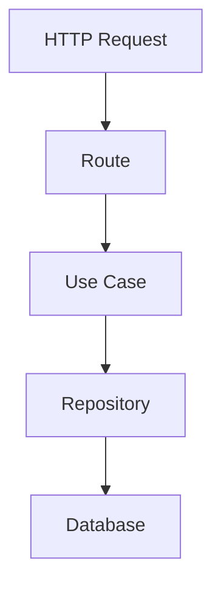

# Arquitectura Hexagonal

Xkala System implementa arquitectura hexagonal para desacoplar lógica de negocio, infraestructura y framework.

---

# Capas

## Interfaces

Contiene:

- routes
- schemas
- controllers

Responsable de entrada HTTP.

---

## Application

Contiene:

- use cases
- services

Responsable de la lógica de aplicación.

---

## Domain

Contiene:

- entidades
- enums
- interfaces repository

Responsable de reglas de negocio.

---

## Infrastructure

Contiene:

- database
- models
- repositories
- external services

Responsable de persistencia.

---

## Core

Contiene:

- security
- exceptions
- middleware
- settings

Responsable de infraestructura transversal.

---

# Flujo

